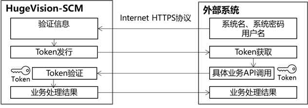
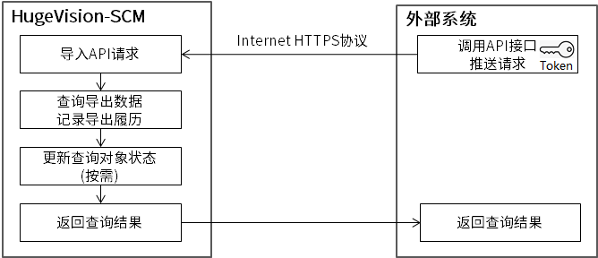
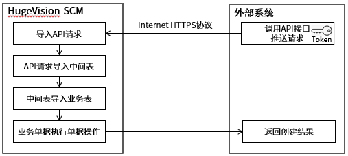

# HugeVision-SCM API

[文档首页](index.md)>HugeVision-SCM API开发手册向导页

---
HugeVision-SCM API是赋能连接与协同的开放接口 
服务使用方的其他系统(后称"外部系统")可以使用API接口与HugeVision-SCM平台进行数据交互和业务协同 

## **文档构成**
##### 点击跳转到相关章节，点击章节名旁边的⇑返回文档构成

[☞API调用说明](#API调用说明) 
[☞API功能说明](#API功能说明) 
[☞API接口列表](#API接口列表) 

## **API调用说明** [⇑](#说明文档构成)

接口需使用HTTPS协议、JSON数据格式、UTF8编码

 

**Step1 协同平台注册** 
在HugeVision-SCM中注册协同平台，获得系统名、系统密码 
在HugeVision-SCM中注册协同平台用户，获得平台用户名、实体、组织、角色 

**Step2 验证身份并获取Token** 
使用Step1中注册的系统名、用户名、系统密码进行登录认证，取得事先配置的实体、组织、角色以获取令牌 
※令牌为JWT-JSON Web Token(RFC7591)认证令牌 
※具体请参考[TOKEN获取](tokens/Tokens.md)

**Step3 缓存和刷新Token** 
开发者需要缓存Token，用于后续接口的调用 
※Token不可以返回外部系统前台，需要保存在后台，所有访问API的请求需由后台发起 
※不能频繁调用TOKEN获取接口，否则会受到频率拦截 

**Step4 调用具体的业务API** 
使用缓存的Token调用具体业务API，具体请参考[API接口列表](#API接口列表]) 
※Token的有效时长为60分钟，当Token失效或过期时，需要重新获取 

---

## **API功能说明** [⇑](#说明文档构成)

### **功能类型** 

API的功能类型有—— 
1、查询业务数据 
查询业务数据，可以同时更新查询数据的导出状态 
2、创建业务数据 
创建业务单据，同时执行单据操作-完成处理(按需) 
3、查询异步处理结果 
查询创建业务数据的处理结果，一般用于异步处理 
4、单据操作 
指定单据号和单据类型，执行单据操作 

### **处理类型**

F:同步处理 
API调用后，同时完成API请求导入及所有后续处理，处理完成后返回处理结果 
※所有功能类型均可支持同步处理 
 
B:异步处理 
API调用后，只执行API请求导入，导入成功即返回"异步处理提交成功"的消息 
每30分钟一次执行计划任务处理上述API请求，处理完成后保留异步处理结果待查 
外部系统需另行调用各业务的**查询异步处理结果API**，查看异步处理结果 
※仅创建业务数据功能类型的API支持异步处理 
 

### **API接口方式图**

#### 查询业务数据
(仅支持同步处理) 
 

#### 创建业务数据(同步)
 

#### 创建业务数据(异步)
 

#### 查询异步处理结果
(仅支持同步处理) 
 

---

## **业务API列表** [⇑](#说明文档构成)

|功能Code|功能类型|处理类型|概述|具体说明
|:--|:---|:--|:----|:--|
|-|认证并获取Token|同步|认证并获取Token|[TOKEN获取](tokens/Tokens.md)
|API010COF|创建业务数据|同步|创建采购订单|[API010COF](processes/API010COF.md)
|API010COB|创建业务数据|异步|创建采购订单|[API010COB](processes/API010COB.md)
|API010NNF|查询异步处理结果|同步|查询采购订单的异步处理结果|[API010NNF](processes/API010NNF.md)
|API020COF|创建业务数据|同步|创建采购退货|[API020COF](processes/API020COF.md)
|API020COB|创建业务数据|异步|创建采购退货|[API020COB](processes/API020COB.md)
|API020NNF|查询异步处理结果|同步|查询采购退货的异步处理结果|[API020NNF](processes/API020NNF.md)
|API030COF|创建业务数据|同步|创建销售订单|[API030COF](processes/API030COF.md)
|API030COB|创建业务数据|异步|创建销售订单|[API030COB](processes/API030COB.md)
|API030NNF|查询异步处理结果|同步|查询销售订单的异步处理结果|[API030NNF](processes/API030NNF.md)
|API040COF|创建业务数据|同步|创建销售订单B2C|[API040COF](processes/API040COF.md)
|API040COB|创建业务数据|异步|创建销售订单B2C|[API040COB](processes/API040COB.md)
|API040NNF|查询异步处理结果|同步|查询销售订单B2C的异步处理结果|[API040NNF](processes/API040NNF.md)
|API050COF|创建业务数据|同步|创建销售退货|[API050COF](processes/API050COF.md)
|API050COB|创建业务数据|异步|创建销售退货|[API050COB](processes/API050COB.md)
|API050NNF|查询异步处理结果|同步|查询销售退货的异步处理结果|[API050NNF](processes/API050NNF.md)
|API060COF|创建业务数据|同步|创建实物领用|[API060COF](processes/API060COF.md)
|API060COB|创建业务数据|异步|创建实物领用|[API060COB](processes/API060COB.md)
|API060NNF|查询异步处理结果|同步|查询实物领用的异步处理结果|[API060NNF](processes/API060NNF.md)
|API09APDF|查询业务数据|同步|查询待处理发货单信息|[API09APDF](processes/API09APDF.md)
|API110ULF|创建业务数据|同步|更新收货确认单信息|[API110ULF](processes/API110ULF.md)
|API111ULF|创建业务数据|同步|更新发货确认单信息|[API111ULF](processes/API111ULF.md)
|API120COF|创建业务数据|同步|创建付款单|[API120COF](processes/API120COF.md)
|API120COB|创建业务数据|异步|创建付款单|[API120COB](processes/API120COB.md)
|API120NNF|查询异步处理结果|同步|查询付款单的异步处理结果|[API120NNF](processes/API120NNF.md)
|API130COF|创建业务数据|同步|创建收款单|[API130COF](processes/API130COF.md)
|API130COB|创建业务数据|异步|创建收款单|[API130COB](processes/API130COB.md)
|API130NNF|查询异步处理结果|同步|查询收款单的异步处理结果|[API130NNF](processes/API130NNF.md)
|API170COF|创建业务数据|同步|创建库存调整单|[API170COF](processes/API170COF.md)
|API170COB|创建业务数据|异步|创建库存调整单|[API170COB](processes/API170COB.md)
|API170NNF|查询异步处理结果|同步|查询库存调整单的异步处理结果|[API170NNF](processes/API170NNF.md)
|API180COF|创建业务数据|同步|创建订购申请|[API180COF](processes/API180COF.md)
|API180COB|创建业务数据|异步|创建订购申请|[API180COB](processes/API180COB.md)
|API180NNF|查询异步处理结果|同步|查询订购申请的异步处理结果|[API180NNF](processes/API180NNF.md)
|API190COF|创建业务数据|同步|创建采购订单(代理商)|[API190COF](processes/API190COF.md)
|API190COB|创建业务数据|异步|创建采购订单(代理商)|[API190COB](processes/API190COB.md)
|API190NNF|查询异步处理结果|同步|查询采购订单(代理商)的异步处理结果|[API190NNF](processes/API190NNF.md)
|API200COF|创建业务数据|同步|创建采购退货(代理商)|[API200COF](processes/API200COF.md)
|API200COB|创建业务数据|异步|创建采购退货(代理商)|[API200COB](processes/API200COB.md)
|API200NNF|查询异步处理结果|同步|查询采购退货(代理商)的异步处理结果|[API200NNF](processes/API200NNF.md)
|API210COF|创建业务数据|同步|创建Sellout|[API210COF](processes/API210COF.md)
|API210COB|创建业务数据|异步|创建Sellout|[API210COB](processes/API210COB.md)
|API210NNF|查询异步处理结果|同步|查询Sellout的异步处理结果|[API210NNF](processes/API210NNF.md)
|API220COF|创建业务数据|同步|创建请购单|[API220COF](processes/API220COF.md)
|API220COB|创建业务数据|异步|创建请购单|[API220COB](processes/API220COB.md)
|API220NNF|查询异步处理结果|同步|查询请购单的异步处理结果|[API220NNF](processes/API220NNF.md)
|API230DLF|查询业务数据|同步|查询库存明细信息|[API230DLF](processes/API230DLF.md)
|API240DLF|查询业务数据|同步|查询业务伙伴(客户)信息|[API240DLF](processes/API240DLF.md)
|API241DLF|查询业务数据|同步|查询业务伙伴(供应商)信息|[API241DLF](processes/API241DLF.md)
|API242DLF|查询业务数据|同步|查询业务伙伴(其他)信息|[API242DLF](processes/API242DLF.md)
|API250DLF|查询业务数据|同步|查询产品信息|[API250DLF](processes/API250DLF.md)
|API260DLF|查询业务数据|同步|查询盘点单信息|[API260DLF](processes/API260DLF.md)
|API260ULF|创建业务数据|同步|更新盘点单信息|[API260ULF](processes/API260ULF.md)
|API270COF|创建业务数据|同步|创建询价单|[API270COF](processes/API270COF.md)
|API270COB|创建业务数据|异步|创建询价单|[API270COB](processes/API270COB.md)
|API270NNF|查询异步处理结果|同步|查询询价单的异步处理结果|[API270NNF](processes/API270NNF.md)
|API280ULF|创建业务数据|同步|更新询价单响应信息|[API280ULF](processes/API280ULF.md)
|API290COF|单据操作|同步|单据操作完成|[API290COF](processes/API290COF.md)
|API290VOF|单据操作|同步|单据操作作废|[API290VOF](processes/API290VOF.md)
|API290CLF|单据操作|同步|单据操作关闭|[API290CLF](processes/API290CLF.md)
|API290RCF|单据操作|同步|单据操作冲销|[API290RCF](processes/API290RCF.md)
