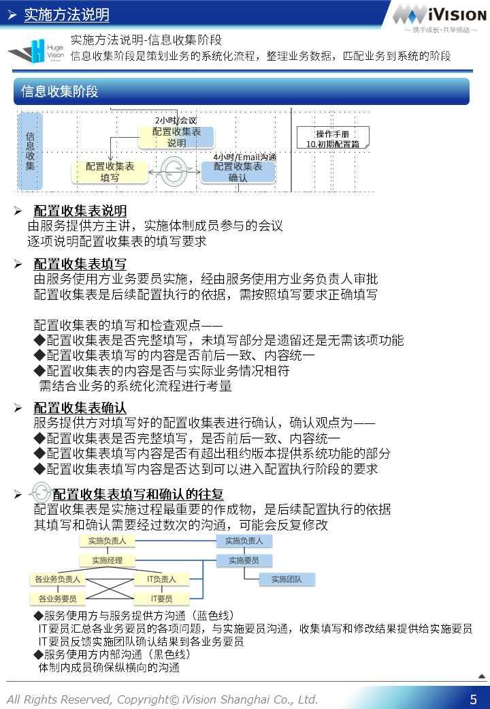
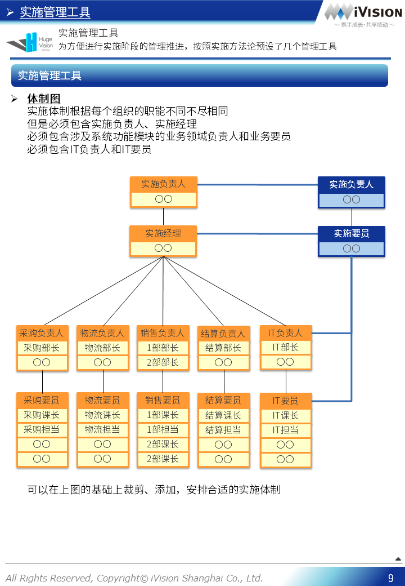

# HugeVision-SCM实施手册-00.实施说明篇

##### [文档首页](../../../index.md)>HugeVision-SCM实施手册-00.实施说明篇
---

## 目录

##### 点击跳转到相关章节，点击⇑，点击⏎返回文档首页

#### [实施方法说明](#1)
#### [实施管理工具](#2)

---
 		

---

[本篇目录⇑](#目录)&nbsp;&nbsp;[文档首页↶](../../../index.md) 

 		[本篇目录⇑](#目录)&nbsp;&nbsp;[文档首页↶](../../../index.md) 
 		[本篇目录⇑](#目录)&nbsp;&nbsp;[文档首页↶](../../../index.md) 
 		[本篇目录⇑](#目录)&nbsp;&nbsp;[文档首页↶](../../../index.md) 
 		[本篇目录⇑](#目录)&nbsp;&nbsp;[文档首页↶](../../../index.md) 
 		[本篇目录⇑](#目录)&nbsp;&nbsp;[文档首页↶](../../../index.md) 
 		

[本篇目录⇑](#目录)&nbsp;&nbsp;[文档首页↶](../../../index.md) 
 		[本篇目录⇑](#目录)&nbsp;&nbsp;[文档首页↶](../../../index.md) 
 		[本篇目录⇑](#目录)&nbsp;&nbsp;[文档首页↶](../../../index.md) 
 		

