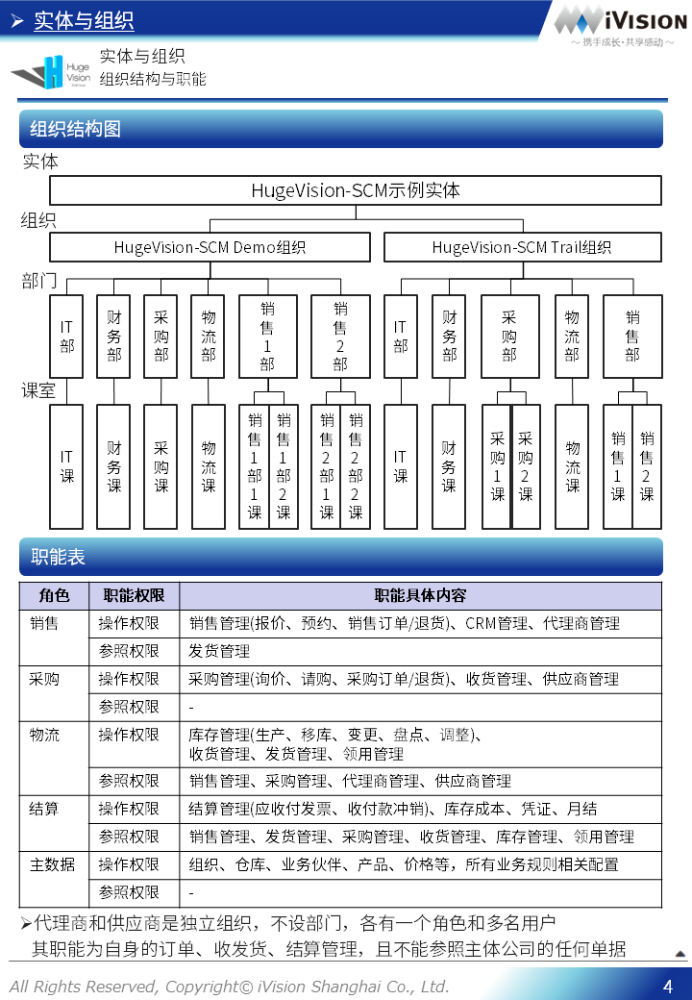

# HugeVision-SCM实施手册-10.业务规则篇

##### [文档首页](../../正式版入口.md)>HugeVision-SCM实施手册-10.业务规则篇
---

## 目录

##### 点击跳转到相关章节，点击⇑返回本篇目录，点击↶返回文档首页

#### [实体/组织](#1)
#### [业务伙伴](#2)
#### [仓库/库位](#3)
#### [产品/价格](#4)
#### [库存管理](#5)
#### [单据类型](#6)
#### [发货控制](#7)
#### [审批流程](#8)
#### [CRM管理](#9)
#### [结算相关](#10)

---
 		

---

[本篇目录⇑](#目录)&nbsp;&nbsp;[文档首页↶](../../../index.md) 

 		[本篇目录⇑](#目录)&nbsp;&nbsp;[文档首页↶](../../../index.md) 
 		[本篇目录⇑](#目录)&nbsp;&nbsp;[文档首页↶](../../../index.md) 
 		

[本篇目录⇑](#目录)&nbsp;&nbsp;[文档首页↶](../../../index.md) 
 		[本篇目录⇑](#目录)&nbsp;&nbsp;[文档首页↶](../../../index.md) 
 		[本篇目录⇑](#目录)&nbsp;&nbsp;[文档首页↶](../../../index.md) 
 		[本篇目录⇑](#目录)&nbsp;&nbsp;[文档首页↶](../../../index.md) 
 		

[本篇目录⇑](#目录)&nbsp;&nbsp;[文档首页↶](../../../index.md) 
 		[本篇目录⇑](#目录)&nbsp;&nbsp;[文档首页↶](../../../index.md) 
 	

[本篇目录⇑](#目录)&nbsp;&nbsp;[文档首页↶](../../../index.md) 
 		[本篇目录⇑](#目录)&nbsp;&nbsp;[文档首页↶](../../../index.md) 
 		[本篇目录⇑](#目录)&nbsp;&nbsp;[文档首页↶](../../../index.md) 
 

[本篇目录⇑](#目录)&nbsp;&nbsp;[文档首页↶](../../../index.md) 
 		[本篇目录⇑](#目录)&nbsp;&nbsp;[文档首页↶](../../../index.md) 
 		[本篇目录⇑](#目录)&nbsp;&nbsp;[文档首页↶](../../../index.md) 
 		[本篇目录⇑](#目录)&nbsp;&nbsp;[文档首页↶](../../../index.md) 
 		

[本篇目录⇑](#目录)&nbsp;&nbsp;[文档首页↶](../../../index.md) 
 	[本篇目录⇑](#目录)&nbsp;&nbsp;[文档首页↶](../../../index.md) 
 		[本篇目录⇑](#目录)&nbsp;&nbsp;[文档首页↶](../../../index.md) 
 		[本篇目录⇑](#目录)&nbsp;&nbsp;[文档首页↶](../../../index.md) 
 		[本篇目录⇑](#目录)&nbsp;&nbsp;[文档首页↶](../../../index.md) 
   [本篇目录⇑](#目录)&nbsp;&nbsp;[文档首页↶](../../../index.md) 
 		[本篇目录⇑](#目录)&nbsp;&nbsp;[文档首页↶](../../../index.md) 
 		[本篇目录⇑](#目录)&nbsp;&nbsp;[文档首页↶](../../../index.md) 
 		[本篇目录⇑](#目录)&nbsp;&nbsp;[文档首页↶](../../../index.md) 
 		[本篇目录⇑](#目录)&nbsp;&nbsp;[文档首页↶](../../../index.md) 
   

[本篇目录⇑](#目录)&nbsp;&nbsp;[文档首页↶](../../../index.md) 
   [本篇目录⇑](#目录)&nbsp;&nbsp;[文档首页↶](../../../index.md) 
   [本篇目录⇑](#目录)&nbsp;&nbsp;[文档首页↶](../../../index.md) 
 

[本篇目录⇑](#目录)&nbsp;&nbsp;[文档首页↶](../../../index.md) 
   [本篇目录⇑](#目录)&nbsp;&nbsp;[文档首页↶](../../../index.md) 
   [本篇目录⇑](#目录)&nbsp;&nbsp;[文档首页↶](../../../index.md) 
   [本篇目录⇑](#目录)&nbsp;&nbsp;[文档首页↶](../../../index.md) 
   [本篇目录⇑](#目录)&nbsp;&nbsp;[文档首页↶](../../../index.md) 
 

[本篇目录⇑](#目录)&nbsp;&nbsp;[文档首页↶](../../../index.md) 
   [本篇目录⇑](#目录)&nbsp;&nbsp;[文档首页↶](../../../index.md) 
   [本篇目录⇑](#目录)&nbsp;&nbsp;[文档首页↶](../../../index.md) 
 

[本篇目录⇑](#目录)&nbsp;&nbsp;[文档首页↶](../../../index.md) 
   [本篇目录⇑](#目录)&nbsp;&nbsp;[文档首页↶](../../../index.md) 
   [本篇目录⇑](#目录)&nbsp;&nbsp;[文档首页↶](../../../index.md) 
   [本篇目录⇑](#目录)&nbsp;&nbsp;[文档首页↶](../../../index.md) 
   [本篇目录⇑](#目录)&nbsp;&nbsp;[文档首页↶](../../../index.md) 
   [本篇目录⇑](#目录)&nbsp;&nbsp;[文档首页↶](../../../index.md) 

