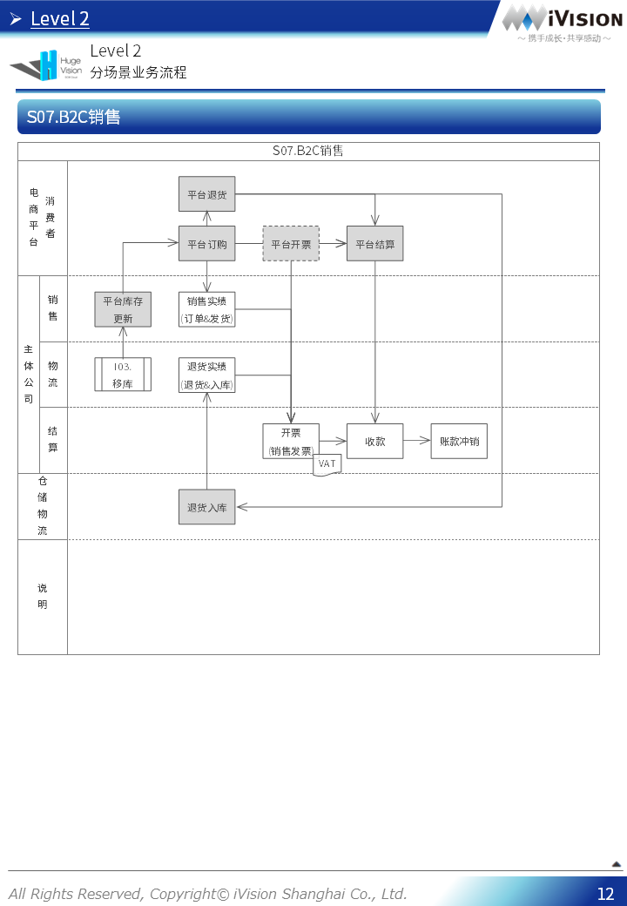

# HugeVision-SCM实施手册-20.业务流程篇

##### [Manual导航页](../../正式版入口.md)> HugeVision-SCM实施手册-20.业务流程篇

---

## 目录
---

#### [Level 1 流程模块总览](#1)
#### [Level 2 分场景业务流程](#2)
#### [Level 3 分场景业务操作](#3)

---
 		

---

[返回目录](#目录) 

 		[返回目录](#目录) 
 		

[返回目录](#目录) 
 		[返回目录](#目录) 
 		[返回目录](#目录) 
 		[返回目录](#目录) 
 		[返回目录](#目录) 
 		[返回目录](#目录) 
 		[返回目录](#目录) 
 	[返回目录](#目录) 
 	[返回目录](#目录) 
 	[返回目录](#目录) 
 	[返回目录](#目录) 
 	[返回目录](#目录) 
 	[返回目录](#目录) 
 	[返回目录](#目录) 
 	[返回目录](#目录) 
 	[返回目录](#目录) 
 	[返回目录](#目录) 
 	[返回目录](#目录) 
 	[返回目录](#目录) 
 	[返回目录](#目录) 
 	[返回目录](#目录) 
 	[返回目录](#目录) 
 	[返回目录](#目录) 
 	[返回目录](#目录) 
 	[返回目录](#目录) 
 	[返回目录](#目录) 
 	[返回目录](#目录) 
 	[返回目录](#目录) 
 	[返回目录](#目录) 
 	[返回目录](#目录) 
 	[返回目录](#目录) 
 	

[返回目录](#目录) 
 	[返回目录](#目录) 
 	[返回目录](#目录) 

Page37~69: **Level3流程 **
非一般公开文档，请[联系我们](https://www.ivision-china.cn/contact-rgt.html)获取最新版资料
