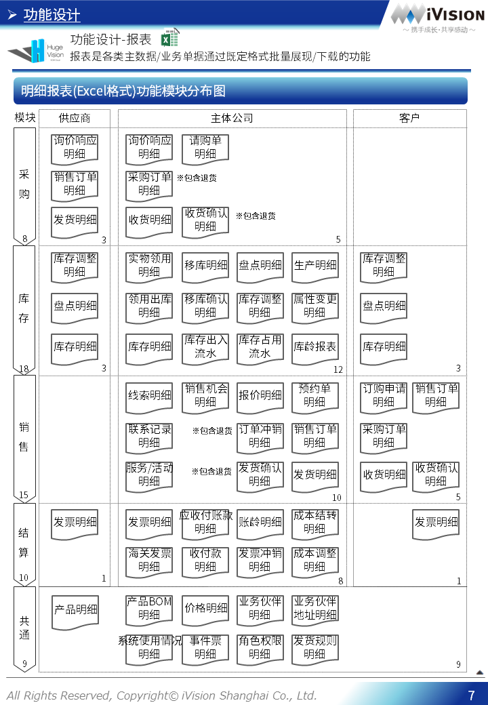

# HugeVision-SCM实施手册-00.系统设计篇

##### [文档首页](../../../index.md)>HugeVision-SCM实施手册-00.系统设计篇
---

## 目录

##### 点击跳转到相关章节，点击⇑返回本篇目录，点击↶返回文档首页

#### [功能设计](#1)
#### [非功能设计](#2)

---
 		

---

[本篇目录⇑](#目录)&nbsp;&nbsp;[文档首页↶](../../../index.md) 

 		[本篇目录⇑](#目录)&nbsp;&nbsp;[文档首页↶](../../../index.md) 
 		[本篇目录⇑](#目录)&nbsp;&nbsp;[文档首页↶](../../../index.md) 
 		[本篇目录⇑](#目录)&nbsp;&nbsp;[文档首页↶](../../../index.md) 
 		[本篇目录⇑](#目录)&nbsp;&nbsp;[文档首页↶](../../../index.md) 
 		[本篇目录⇑](#目录)&nbsp;&nbsp;[文档首页↶](../../../index.md) 
 		[本篇目录⇑](#目录)&nbsp;&nbsp;[文档首页↶](../../../index.md) 
 		[本篇目录⇑](#目录)&nbsp;&nbsp;[文档首页↶](../../../index.md) 
 		[本篇目录⇑](#目录)&nbsp;&nbsp;[文档首页↶](../../../index.md) 
 		

[本篇目录⇑](#目录)&nbsp;&nbsp;[文档首页↶](../../../index.md) 
 		[本篇目录⇑](#目录)&nbsp;&nbsp;[文档首页↶](../../../index.md) 
 		[本篇目录⇑](#目录)&nbsp;&nbsp;[文档首页↶](../../../index.md) 

 		[本篇目录⇑](#目录)&nbsp;&nbsp;[文档首页↶](../../../index.md) 
 		[本篇目录⇑](#目录)&nbsp;&nbsp;[文档首页↶](../../../index.md) 

 		[本篇目录⇑](#目录)&nbsp;&nbsp;[文档首页↶](../../../index.md) 
 		[本篇目录⇑](#目录)&nbsp;&nbsp;[文档首页↶](../../../index.md) 
 		[本篇目录⇑](#目录)&nbsp;&nbsp;[文档首页↶](../../../index.md) 
 		[本篇目录⇑](#目录)&nbsp;&nbsp;[文档首页↶](../../../index.md) 
 		[本篇目录⇑](#目录)&nbsp;&nbsp;[文档首页↶](../../../index.md) 
