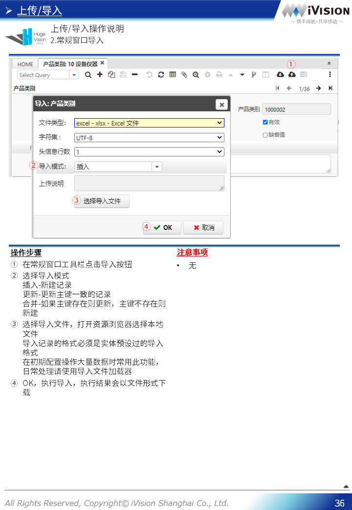

# HugeVision-SCM操作手册-00.基本操作篇

##### [Manual导航页](../../正式版入口.md)>HugeVision-SCM操作手册-00.基本操作篇
---

## 目录
---

#### [登录画面](#1)
#### [HOME画面](#2)
#### [常规窗口](#3)
#### [信息窗口](#4)
#### [流程处理](#5)
#### [报表/导出](#6)
#### [上传/导入](#7)
#### [个人中心](#8)

---
 		

---

[返回目录](#目录) 

 		[返回目录](#目录) 
 		[返回目录](#目录) 
 		[返回目录](#目录) 
 		[返回目录](#目录) 
 		

[返回目录](#目录) 
 		[返回目录](#目录) 
 		[返回目录](#目录) 
 		[返回目录](#目录) 
 		

[返回目录](#目录) 
 		[返回目录](#目录) 
 		[返回目录](#目录) 
 		[返回目录](#目录) 
 		[返回目录](#目录) 
 		[返回目录](#目录) 
 		[返回目录](#目录) 
 		[返回目录](#目录) 
 		

[返回目录](#目录) 
 		[返回目录](#目录) 
 		[返回目录](#目录) 
 		[返回目录](#目录) 
 		

[返回目录](#目录) 
 		[返回目录](#目录) 
 		[返回目录](#目录) 
 		

[返回目录](#目录) 
 		[返回目录](#目录) 
 		[返回目录](#目录) 
 		[返回目录](#目录) 
 		[返回目录](#目录) 
 		[返回目录](#目录) 
 		

[返回目录](#目录) 
 		[返回目录](#目录) 
 		[返回目录](#目录) 
 		[返回目录](#目录) 
 		[返回目录](#目录) 
 		

[返回目录](#目录) 
 		[返回目录](#目录) 
 		[返回目录](#目录) 
 		[返回目录](#目录) 
 		[返回目录](#目录) 
 		[返回目录](#目录) 
 		[返回目录](#目录) 
 		[返回目录](#目录) 
 		[返回目录](#目录) 
 		[返回目录](#目录) 
 		[返回目录](#目录) 
 		[返回目录](#目录) 
 		[返回目录](#目录) 
 		[返回目录](#目录) 
 		[返回目录](#目录) 
 		[返回目录](#目录) 
 		[返回目录](#目录) 
 		[返回目录](#目录) 

