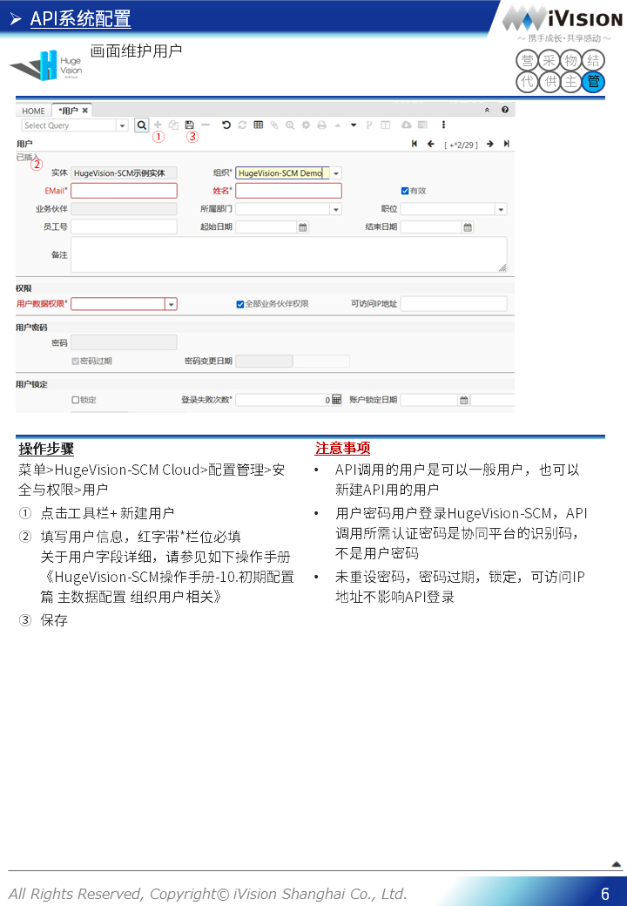
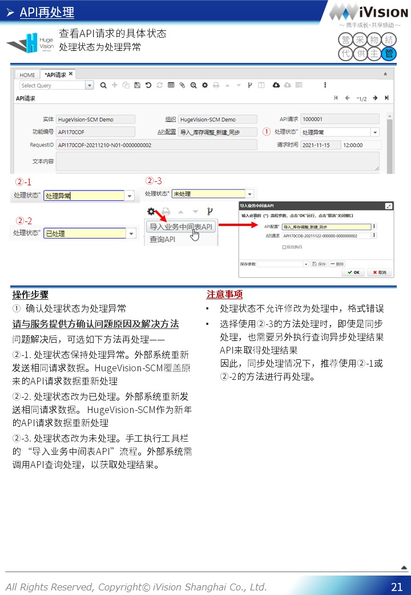

# HugeVision-SCM操作手册-900.API篇

##### [文档首页](../../../index.md)>HugeVision-SCM操作手册-900.API篇
---

## 目录
---

#### [使用准备-API系统配置](#1)
#### [日常运用-查看API日志](#2)
#### [日常运用-API再处理](#3)

---
 		

---

[返回目录](#目录) 

 		[返回目录](#目录) 
 		[返回目录](#目录) 
 		[返回目录](#目录) 
 		[返回目录](#目录) 
 		[返回目录](#目录) 
 		[返回目录](#目录) 
 		[返回目录](#目录) 
 		[返回目录](#目录) 
 	

[返回目录](#目录) 
 	[返回目录](#目录) 
 	[返回目录](#目录) 
 	[返回目录](#目录) 
 	[返回目录](#目录) 
 	[返回目录](#目录) 
 	[返回目录](#目录) 
 	[返回目录](#目录) 
 	

[返回目录](#目录) 
 	[返回目录](#目录) 
 	[返回目录](#目录) 
 	[返回目录](#目录) 
 	[返回目录](#目录) 
 	[返回目录](#目录) 
