# HugeVision-SCM操作手册-00.运维说明篇

##### [文档首页](../../../index.md)>HugeVision-SCM操作手册--00.运维说明篇
---

## 目录
---

#### [运维方法概述](#1)
#### [运维流程说明](#2)
#### [运维工具说明](#3)

---
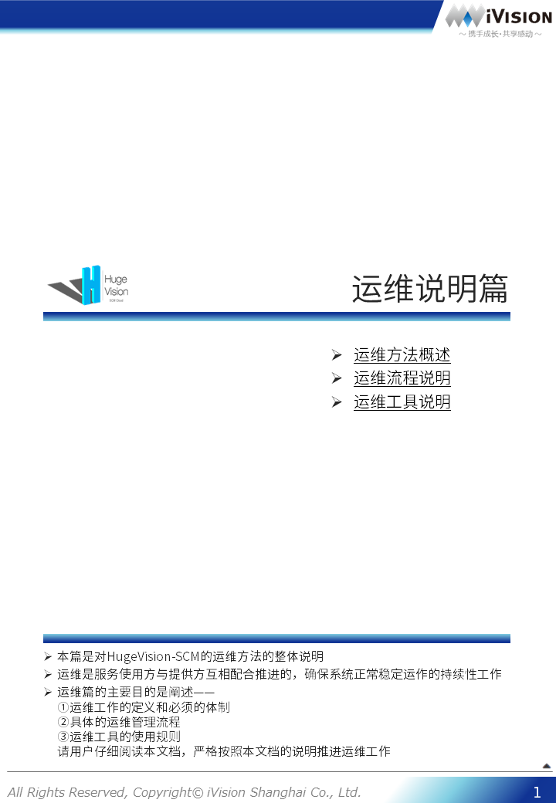 		

---

[返回目录](#目录) 

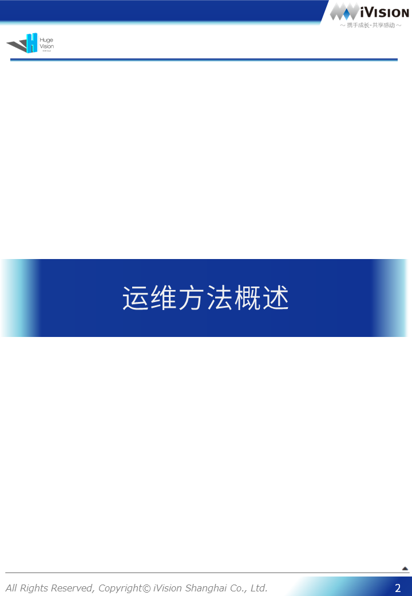 		[返回目录](#目录) 
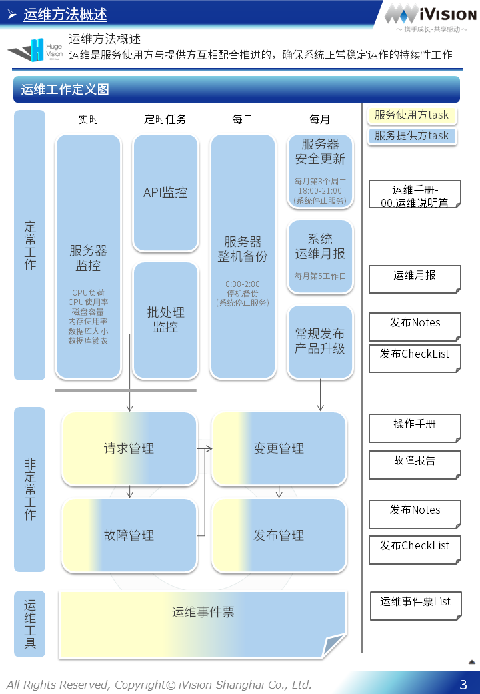 		[返回目录](#目录) 
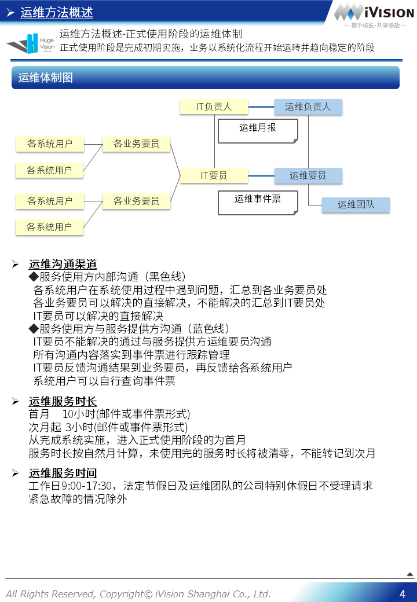 		[返回目录](#目录) 

 		[返回目录](#目录) 
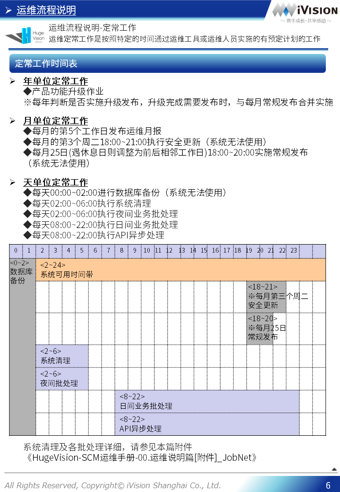 		[返回目录](#目录) 
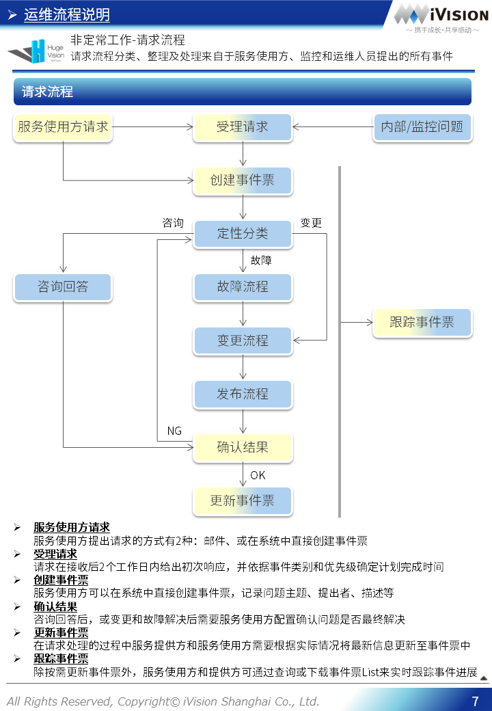 		[返回目录](#目录) 
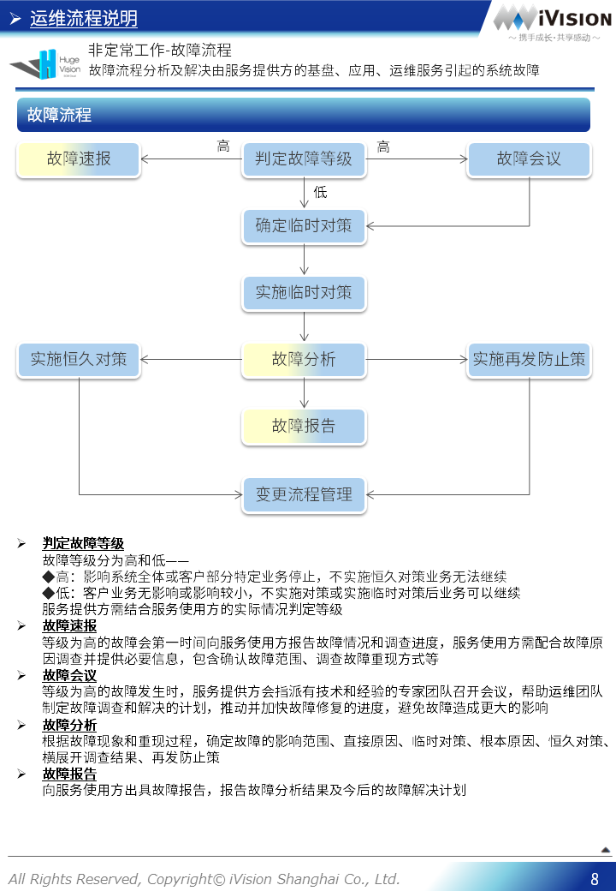 		[返回目录](#目录) 
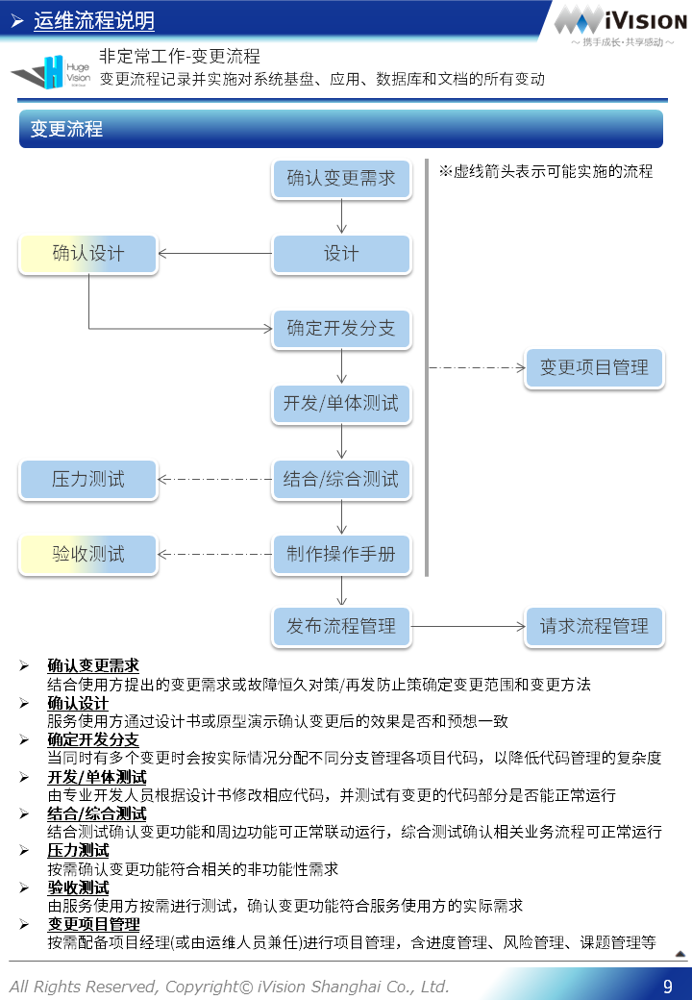 		[返回目录](#目录) 
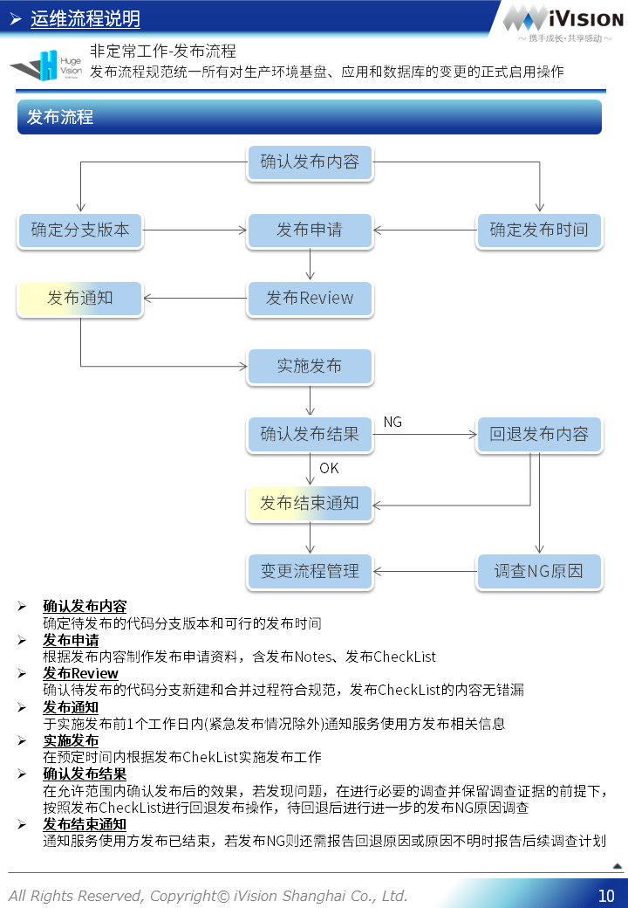 		[返回目录](#目录) 

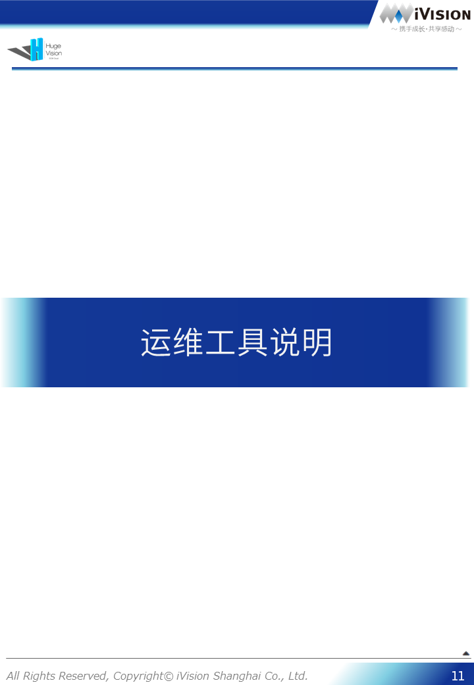 		[返回目录](#目录) 
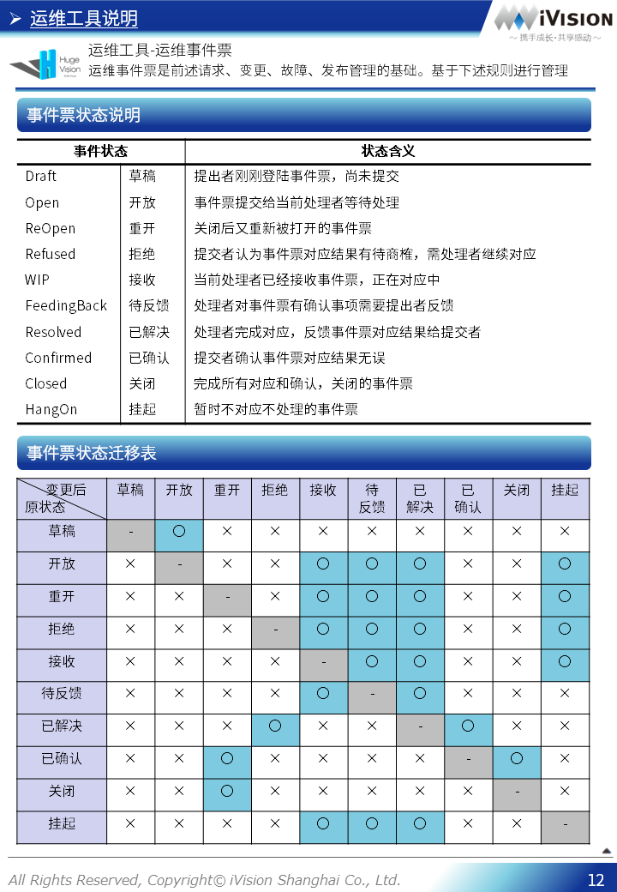 		[返回目录](#目录) 
