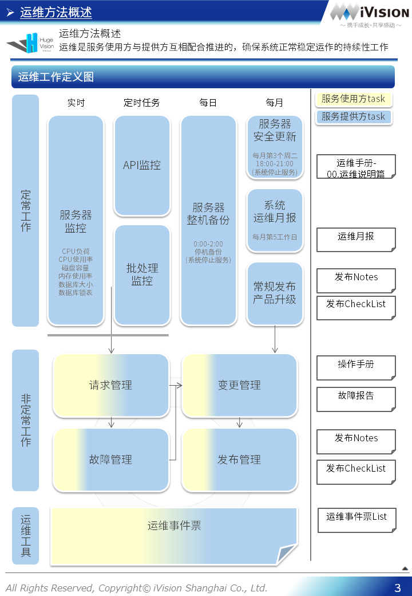
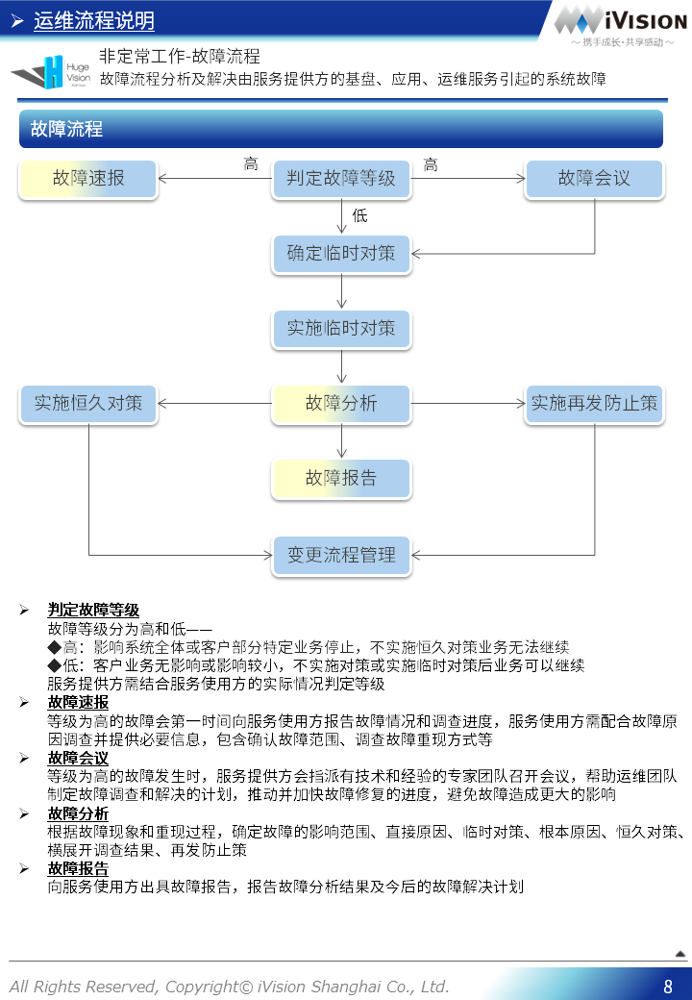
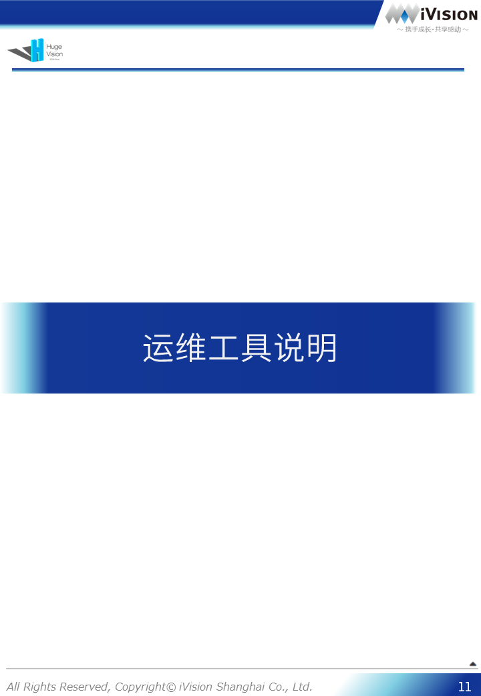
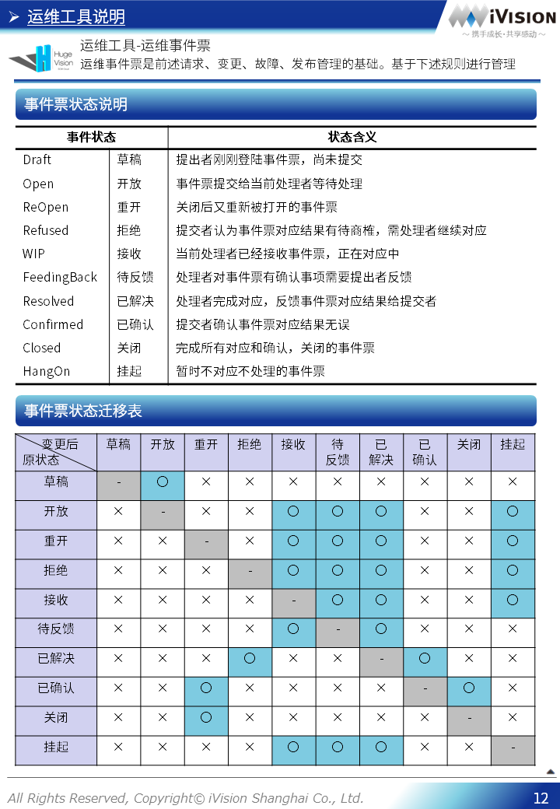

# HugeVision-SCM运维手册-00.运维说明篇

##### [文档首页](../../正式版入口.md)>HugeVision-SCM运维手册-00.运维说明篇
---

## 目录

##### 点击跳转到相关章节，点击⇑返回本篇目录，点击↶返回文档首页

#### [运维方法概述](#1)
#### [运维流程说明](#2)
#### [运维工具说明](#3)

---
 		

---

[本篇目录⇑](#目录)&nbsp;&nbsp;[文档首页↶](../../正式版入口.md) 

 		[本篇目录⇑](#目录)&nbsp;&nbsp;[文档首页↶](../../正式版入口.md) 
 		[本篇目录⇑](#目录)&nbsp;&nbsp;[文档首页↶](../../正式版入口.md) 
 		

[本篇目录⇑](#目录)&nbsp;&nbsp;[文档首页↶](../../正式版入口.md) 
 		[本篇目录⇑](#目录)&nbsp;&nbsp;[文档首页↶](../../正式版入口.md) 
 		[本篇目录⇑](#目录)&nbsp;&nbsp;[文档首页↶](../../正式版入口.md) 
 		[本篇目录⇑](#目录)&nbsp;&nbsp;[文档首页↶](../../正式版入口.md) 
 		[本篇目录⇑](#目录)&nbsp;&nbsp;[文档首页↶](../../正式版入口.md) 
 		[本篇目录⇑](#目录)&nbsp;&nbsp;[文档首页↶](../../正式版入口.md) 
 		

[本篇目录⇑](#目录)&nbsp;&nbsp;[文档首页↶](../../正式版入口.md) 
 		[本篇目录⇑](#目录)&nbsp;&nbsp;[文档首页↶](../../正式版入口.md) 
 		[本篇目录⇑](#目录)&nbsp;&nbsp;[文档首页↶](../../正式版入口.md) 
